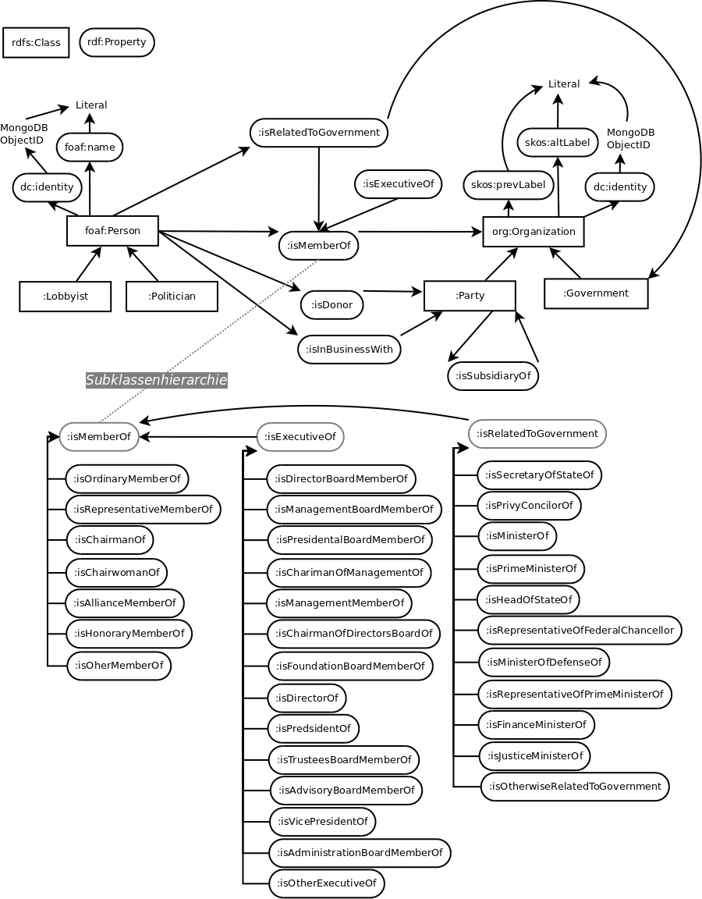

% Projekt-Bericht und Dokumentation im Kurs Wissensrepräsentation SoSe15
% Lukas Hodel; Richard Remus
% 1. August 2015

# Aufgabenstellung

Die gegebene Aufgabenstellung lautete:

Führen Sie ein Semantic Web / Linked Data Projekt durch. Dies sollte mehrere der folgenden Aspekte umfassen:

 - Verknüpfen von verschiedenen Datenquellen
 - Konvertierung von Daten ins RDF-Format (mit entsprechender T-Box)
 - Entwicklung von Ontologien 
 - Linked Data Anwendung 
 - Informationsextraktion/Web Scaping und Konvertierung in RDF
 - Entity Resolution
 - ..

# Idee

Wir haben im Kurs bereits Erfahrungen mit dem [Lobbyradar des ZDF](https://github.com/lobbyradar/lobbyradar "ZDF Lobbyradar") [@lobbyradar] und [DBpedia]("http://wiki.dbpedia.org") [@dbpedia] gemacht.

## Lobbyradar

Das Lobbyradar ist eine vom ZDF zusammengestellte Datenbank, welche die lobbyistischen Verbindungen zwischen Regierungsorganisationen und der Privatwirtschaft transparent machen sollte. Das Lobbyradar besitzt ein Frontend auf dem man sich bequem per Mausklick durch die Lobbylandschaft navigieren kann. Das Projekt mitsamt den Daten ist _open-source_ und auf [Github](https://github.com/lobbyradar/lobbyradar) verfügbar.

## Ziel

Die Daten liegen in einer MongoDB in einer losen Struktur vor. Möchte man nun maschinell darauf zugreifen, ist dies nicht ohne genauem Studiums dessen Inhalts möglich. Nun ist das Ziel dieser Arbeit, die relevantesten Daten in einem semantischen Graphen einfach verfügbar zu machen. Dabei konnte nicht der gesamte Inhalt beachtet werden. Als relevant haben sich die Positionen der  Personen-Organisation-Verbindungen herausgestellt.

## Vorgehen

1. Die Daten des Lobbyradar müssen ausgewertet und priorisiert werden.
2. Aus den Daten muss eine Ontologie abgeleitet werden.
3. Sind die wichtigen Informationen identifiziert, werden sie in einen RDF-Graphen exportiert.
4. Ist der Graph aufgebaut, werden Standardsuchfunktionen per SPARQL definiert.
5. Auch ist eine Anbindung zum weiteren Informationsgewinn von Personen an [DBpedia]("http://wiki.dbpedia.org") [@dbpedia]. 

# Analyse Lobbyradar

Lobbyradar enthält Knoten (Entities) und Kanten (Relations) welche in BSON persistiert sind. In RDF wären die Knoten die Klassen (Subjekt/Objekt) und die Relationen die Properties. Die Knoten enthalten sehr viele unterschiedliche Informationen welche sehr schwer in RDF dargestellt werden können:

```javascript
{'_id': '54bd3c768b934da06340f4c6',
 'aliases': [],
 'created': 'datetime.datetime(2015, 1, 19, 17, 18, 46, 529000)',
 'data': [{'auto': 'True',
   'created': 'datetime.datetime(2015, 1, 19, 17, 19, 9, 420000)',
   'desc': 'Quelle',
   'format': 'link',
   'id': '3dc1416e38deac59076cd3f0d4e1235de79cb530207d06c28053134cc8aa7732',
   'key': 'source',
   'updated': 'datetime.datetime(2015, 1, 19, 17, 19, 9, 420000)',
   'value': {'remark': 'created by lobbyliste importer',
    'url': 'http://bundestag.de/blob/189476/8989cc5f5f65426215d7e0233704b20a/\
    lobbylisteaktuell-data.pdf'}},
  {'auto': 'True',
   'created': 'datetime.datetime(2015, 1, 19, 17, 19, 9, 420000)',
   'desc': 'Titel',
   'format': 'string',
   'id': '65873d29bd0ab6af91ef341689d28f4f0658cc851494a0ef34cfd07dd0cf5d42',
   'key': 'titles',
   'updated': 'datetime.datetime(2015, 1, 19, 17, 19, 9, 420000)',
   'value': 'Gesch\xe4ftsf\xfchrer'},
  {'auto': 'True',
   'created': 'datetime.datetime(2015, 1, 19, 17, 18, 46, 529000)',
   'desc': 'Titel',
   'format': 'string',
   'id': '1c98f43f0787b6dfcad25c38849ef3895bd26624a79c8fa9e6203c360d120fad',
   'key': 'titles',
   'updated': 'datetime.datetime(2015, 1, 19, 17, 18, 46, 529000)',
   'value': '2. Vorsitzender'}],
 'importer': 'lobbyliste',
 'name': 'Markus Hoymann',
 'search': ['markus hoymann'],
 'slug': 'markus hoymann',
 'tags': ['lobbyist', 'lobbyismus', 'executive'],
 'type': 'person',
 'updated': 'datetime.datetime(2015, 1, 19, 17, 19, 9, 426000)'}
```

Deshalb haben wir entschieden, von all diesen, nur die wichtigsten Eigenschaften abzubilden: 

- id
- name
- created
- updated
- type *(Person, Organisation)*
- alias *(nur bei Organisationen)*
- tags *(als Interessengebiete)*

Die verschiedenen Relationen zwischen diesen Entitäten sind an der Struktur nicht erkennbar. Diese kann nur durch Analyse der Positionsinformationen ermittelt werden. _Position_ ist dabei eine Metainformation des jeweiligen Eintrags.

Die verschiedenen Bezeichnungen für die Ämter und Anstellungsverhältnisse der Personen, also ihre Positionen in der Lobbyradar-Datenbank, sind jedoch stark arbiträr, gehorchen keiner Syntax und liegen nur als Literal vor. 
Es ist leider nicht ohne weiteres möglich einer Relation (Property) in RDF eine zusätzliche Bezeichnung als Literal zu geben. Dazu würden wir Hilfsknoten benötigen, welche den Graphen und somit die Suche stark verkomplizieren würden. Deswegen mussten wir diese Relationen in RDF-Properties umwandeln.

Da in der Datenbank auch viele Positionen mit semantisch gleichem Inhalt unterschiedliche Bezeichnungen haben, entweder weil keine einheitliche Benennung vorgegeben ist (*z.B. Bundesminister der Finanzen, Finanzminister, Minister der Finanzen*) oder weil die Importeure Tippfehler gemacht haben (*executive, ececutive*), haben wir uns entschieden, die wichtigsten Relationen semantisch zu gruppieren.

Die damit generierte RDF-Ontologie wurde so in der Datei "ontology.ttl" hierarchisch zusammengefasst.

__Diese Zuordnung mussten wir händisch erledigen, aus Zeitgründen konnten wir also die restlichen Daten nicht Berücksichtigen.__

# Aufbau der Ontologie

## Bild



## Konvertierung der Daten in RDF
Um die Daten in RDF überführen zu können, müssen wir zunächst eine hierarchische Ontologie in `ontology.ttl` nach Turtle-Syntax erstellen.

## T-Box

Grundsätzlich muss man sich bei der Erstellung der Ontologie entscheiden, ob man direkt bereits vorhandene Namespaces verwendet oder einen eigenen erstellt.
Wir haben uns entschieden, eine Kombination aus vorhandenen Namespaces und einem eigenen zu erstellen, wobei die eigenen Klassen von den ähnlichsten, "offiziellen" Klassen abgeleitet wurden. Dabei haben wir die Erfahrung gemacht, dass es sehr schwer ist, für ein spezielles Themengebiet, taugliche (eindeutige) offizielle Klassen zu finden. Diese Suche nach Vokabularen, welche auf die vom Lobbyradar beschriebenen Eigenschaften der Entitäten gut passen, bildete sich als eine zeitaufwändige und selten erfolgreiche Tätigkeit heraus.

Die wichtigsten Klassen der entstandenen Ontologie sind:

```ttl
  # Partei
  :Party a rdfs:Class ;
    rdfs:subClassOf org:Organization .

  # Regierung
  :Government a rdfs:Class ;
    rdfs:subClassOf org:Organization .

  # Politiker
  :Politician a rdfs:Class ;
    rdfs:subClassOf foaf:Person .
  
  # Lobbyist
  :Lobbyist a rdfs:Class ;
    rdfs:subClassOf foaf:Person .
```

Da aus dem Datensatz sehr schwer ersichtlich ist, ob eine Person ein Politiker oder Lobbyist ist, haben wir diese Kategorisierung noch nicht umgesetzt. Dafür würden wir vorschlagen, in Zukunft diese Entitäten mit Hilfe von OWL und einem guten Reasoner automatisch zu identifizieren. Aus Zeitgründen haben wir darauf verzichtet.

Auch mussten wir eigene Properties anlegen, zum Beispiel:

``` 
  # Mitglied
  :isMemberOf a rdf:Property ; 
    rdfs:domain foaf:Person ;
    rdfs:range :Organization .
  
  #Vorsitzender
  :isExecutiveOf rdfs:isSubPropertyOf :isMemberOf . 

  # steht in Verbindung mit einer Regierung
  :isRelatedToGovernment rdfs:isSubPropertyOf :isMemberOf ;
    rdfs:domain foaf:Person ;
    rdfs:range :Government .
```

Mit diesen drei Properties oder deren subProperties werden die Relationen zwischen Personen und Organisationen oder Personen und Regierungen dargestellt. Diese subProperties sind beispielsweise:

```
  # Stellvertretender Vorsitz, Vize-Präsident
  :isVicePresidentOf rdfs:isSubPropertyOf :isExecutiveOf . 

  # Obmann
  :isChairmanOf rdfs:isSubPropertyOf :isMemberOf . 

  #Staatssekretär
  isSecretaryOfStateOf rdfs:isSubPropertyOf :isRelatedToGovernment . 
```

Die Zuordnung war nicht trivial, da wir uns über passende Oberbegriffe Gedanken machen mussten und die Einordnung von Hand geschah.

## A-Box

Zunächst wird über alle _Persons_ und _Entities_ in der Datenbank iteriert und  dementsprechend Knoten im RDF-Graphen erstellt. Jeder dieser Knoten erhält die Properties `DC:identifier`, `DC:created` und `DC:modified`. Wenn der Eintrag vom Typ Person ist, wird er der Klasse `FOAF:Person`  zugeordnet, der Name wird durch das RDF-Property `FOAF:name` angegeben. Da es sich um tatsächliche Personen handelt, fanden wir das Friend-Of-A-Friend-Vokabular angemessen.

Ansonsten erhält er die Klasse `ORG:Organization`, deren Name als `SKOS:prefLabel` gespeichert wird. Wenn ein `alias` vorhanden ist, wird dieses in Form einer `SKOS:altLabel`-Property repräsentiert. Diese Wahl wurde für uns schon durch den ORG-Namespace getroffen, welche das Simple Knowledge Organization System (SKOS) referenziert und spezifiziert, dass `SKOS:prefLabel` für den rechtlich relevanten Namen einer Organisation und `SKOS:altLabel` für alle anderen bekannten Namen verwendet werden sollen.

Ausserdem werden alle Tags (siehe BSON `tags`) als `FOAF:topic_interest`-Property angefügt.

Für die Zuordnung der Relationen müssen wir zunächst Listen erstellen, die verschiedenen Bezeichnungen analog zu unserer Turtle-Ontologie zusammenfassen. Also zum Beispiel, dass die Bezeichnungen _Präsident, Vorsitz, Vorsitzender, Präsidentin_ alle der Liste _Presidents_ angehören und somit als RDF-Property `OWN:isPresidentOf` abgebildet werden.

Anschliessend iterieren wir zum Beispiel über alle Relationen vom Typ _executive_ (oder _ececutive_, _Vorsitzender_). Dann prüfen wir ob die angegebene Bezeichnung der Position in einer der Listen zu finden ist, die die RDF-subProperties von `OWN:isExecutiveOf` darstellen. Die Person-Organisation-Relation wird dann mit der passendsten Property abgebildet, falls sie nicht in einer Liste enthalten ist, wird sie als `OWN:isOtherExecutiveOf` angefügt.

Analog verfahren wir mit allen Relationen vom Typ _member, activity_ oder _position_ und dem OWN:isMemberOf-Property oder den Relationen der Typen _government_ und _Bundesdatenschutzbeauftragte_ und `OWN:isRelatedToGovernment`.

__Die A-Box und die T-Box stellen gemeinsam den semantischen Graphen dar.__

# Benutzung des Programms, Lobbyradar

Zu erst muss die Datei `Graph.py` und deren Funktionen importiert werden. Wichtig zu wissen ist, dass die Libraries [_pymongo_](ttps://pypi.python.org/pypi/pymongo) [@pymongo], [_bson_](https://pypi.python.org/pypi/bson/0.4.0) [@bson], [_rdflib_](https://github.com/RDFLib/rdflib/) [@rdflib], [_networkx_](http://networkx.github.io) [@networkx] und [_matplotlib_](http://matplotlib.org) [@matplotlib] vorhanden sein müssen.

```python
    import Graph
    from Graph import search_persons, person_connections,  \
                      search_organizations, \
                      organization_connections, plot_triples, \
                      search_governmental, search_sparql
    %matplotlib inline 
```

## Nach Personen suchen

Mit der Methode __search_persons__ kann mittels Freitext nach Personen gesucht werden.

```python
    search_persons(name="angela m", limit=10)

    [u'Angela Merkel', u'Angela Marquardt']
```

## Verbindungen einer Person ausgeben

Hat man den korrekten Namen der Person identifiziert, kann mit Hilfe der Methode __person_connections__ nach "Connections", also in unserem Fall Organisationen, gesucht werden. Es wird eine Liste von Tripeln mit ('personenname', 'property', 'Organisationslabel') zurück gegeben.
Dabei ist die Information, welcher tatsächliche RDF-Typ dahinter steckt, aus Übersichtsgründen weggelassen worden.

```python
    angela_connections = person_connections("Angela Merkel")
    angela_connections[:2]
    
    [(u'Angela Merkel',
      u'http://example.org/isOtherwiseRelatedToGovernment',
      u'Bundeskanzleramt'),
     (u'Angela Merkel',
      u'http://example.org/isOtherMemberOf',
      u'Atlantik-Br\xfccke e.V.')]
```

## Resultat plotten

Die Methode __plot_triples__ visualisiert nun die Tripel in einem Graphen. Dabei werden die "Subjekte" Grün und die "Objekte" rot dargestellt. In unserem Fall sind die Personen grün und die Organisationen rot dargestellt.

```python
    plot_triples(angela_connections)
```


Wie in Figure 1 zu sehen ist, werden die Relationen nicht betitelt, da die Übersichtlichkeit sonst enorm darunter gelitten hätte. Wir sind zum Entschluss gekommen, dass es wichtiger ist, das Vorhandensein einer Verbindung grafisch darzustellen. Um welche Art von Verbindung es sich dabei handelt, kann direkt vom Suchergebnis abgelesen werden.  

## Nach Organisationen suchen

Mit der Methode __search_organizations__ kann mittels Freitext nach Organisationen gesucht werden.

```python
    search_organizations("SPD")
    [u'SPD', u'SPD-NRW', u'SPD-Bundestagsfraktion', u'SPD Vorpommern']
```

## Verbindungen einer Organisationen ausgeben

Nun kann mit der Methode __organization_connections__ nach Personen-Verbindungen dieser Organisation gesucht werden.
Als Ergebnis erhält man wiederum Tripel, analog zur Methode __person_connections__.

```python
    org_conn_triple = organization_connections("SPD-Bundestagsfraktion")
    org_conn_triple[:4]

    [(u'Bernhard Daldrup',
      u'http://example.org/isOtherMemberOf',
      u'SPD-Bundestagsfraktion'),
     (u'Gabriele Hiller-Ohm',
      u'http://example.org/isOtherMemberOf',
      u'SPD-Bundestagsfraktion'),
     (u'Daniela De Ridder',
      u'http://example.org/isOtherMemberOf',
      u'SPD-Bundestagsfraktion'),
     (u'Nina Dr. Nina Scheer',
      u'http://example.org/isOtherMemberOf',
      u'SPD-Bundestagsfraktion')]
```

## Verbindungen einer Organisationen plotten

Diese können dann wiederum mit der Methode __plot_triples__ geplottet werden. Wenn der Graph zu groß wird, kann die Größe des Plots selbst über den Parameter `figsize?` angegeben werden. Siehe dazu Figure 2.

```python
    plot_triples(org_conn_triple, figsize=(25,25))
```


## Nach Bundes-Organisationen suchen

Mit der Methode __search_governmental__ kann ausschliesslich nach Bundesorganisationen gesucht werden.

```python
    gov_organizations = search_governmental()
    gov_organizations[:10]
```

```python
    [u'Nieders\xe4chsisches Kultusministerium',
     u'Bayrisches Staatsministerium f\xfcr Ern\xe4hrung, Landwirtschaft\
      und Forsten',
     u'Bayrisches Staatsministerium f\xfcr Arbeit und Soziales, Familie\
      und Integration',
     u'Ministerium f\xfcr Inneres und Kommunales Nordrhein-Westfalen',
     u'Hessisches Ministerium der Finanzen',
     u'Staatsministerium Baden-W\xfcrttemberg',
     u'Ministerium f\xfcr Landwirtschaft, Umwelt und Verbraucherschutz\
      Mecklenburg-Vorpommern',
     u'Staatskanzlei Sachsen-Anhalt',
     u'Nieders\xe4chsisches Ministerium f\xfcr Ern\xe4hrung,\
      Landwirtschaft und Verbraucherschutz',
     u'Ministerium f\xfcr Schule und Weiterbildung  Nordrhein-Westfalen']
```

```python
    plot_triples(organization_connections("Bundesministerium der Justiz"))
```


## Eigene Sparql abfrage erstellen

Mit der Methode __search_sparql__ kann eine eigene Sparql-Anfrage abgeschickt werden. Zurück erhält man ein rdflib-Abfrage-Resultat, dieses kann dann selbst nach belieben verwendet werden. 

Als Beispiel kann die Ontologie analysiert werden:

```python
    res = search_sparql(""" 
        SELECT DISTINCT ?property ?subproperty
        WHERE {
            ?subproperty rdfs:isSubPropertyOf ?property .
        }
        LIMIT 100
    """)
    
    for row in res:
        print("%s -> %s" % row)
```
    http://example.org/isMemberOf -> http://example.org/isOtherMemberOf
    http://example.org/isMemberOf -> http://example.org/isOrdinaryMemberOf
    http://example.org/isExecutiveOf -> http://example.org/isChairmanOfManagementOf
    http://example.org/isExecutiveOf -> http://example.org/isAdministrationBoardMemberOf
    http://example.org/isExecutiveOf -> http://example.org/isManagementMemberOf
    http://example.org/isExecutiveOf -> http://example.org/isDirectorOf
    http://example.org/isMemberOf -> http://example.org/isRelatedToGovernment
    http://example.org/isExecutiveOf -> http://example.org/isChairmanOfDirectorsBoardOf
    ...

## DBpedia-Informationen einer Person anzeigen

Mit der Methode __dbpedia_person__ können in DBpedia über eine spezifische Person Informationen abgefragt werden. Momentan werden die DBpedia-URI und eine kleine Biographie der Person ausgegeben. Wenn es mehrere Personen gibt die gleich heißen, werden mehrere Zeilen zurückgegeben.

```python
dbpedia_person("Angela Merkel")

[(u'http://dbpedia.org/resource/Angela_Merkel',
  u'beschreibung sehr lange...')]
```

__Uri von Angela Merkel bei dbpedia__ 
`http://dbpedia.org/resource/Angela_Merkel`

__Abstract von Angela Merkel aus dbpedia__
_Angela Dorothea Merkel (* 17. Juli 1954 in Hamburg als Angela Dorothea Kasner) ist eine deutsche Politikerin. Bei der Bundestagswahl am 2. Dezember 1990 errang Merkel, die in der DDR als  Physikerin ausgebildet wurde und auch tätig war, erstmals ein Bundestagsmandat; in allen darauffolgenden sechs Bundestagswahlen wurde sie in ihrem Wahlkreis direkt gewählt. Von 1991 bis 1994 war Merkel Bundesministerin für Frauen und Jugend im Kabinett Kohl IV und von 1994 bis 1998 Bundesministerin für Umwelt, Naturschutz und Reaktorsicherheit im Kabinett Kohl V. Von 1998 bis 2000 amtierte sie als Generalsekretärin der CDU. Seit dem 10. April 2000 ist sie Bundesvorsitzende der CDU und seit dem 22. November 2005 2013 mittlerweile in der dritten Amtsperiode als Chefin von unterschiedlich zusammengesetzten Koalitionsregierungen deutsche Bundeskanzlerin. Sie ist die erste Frau und zugleich die achte Person in der Geschichte der Bundesrepublik, die dieses Amt innehat._

## Eigene Sparql Anfrage an DBpedia senden

Möchte man nun noch genauere Informationen über die Person finden, kann man auch eine eigene Sparql Anfrage senden.

```python
dbpedia_sparql_query("""
  PREFIX foaf: <http://xmlns.com/foaf/0.1/>
  PREFIX dbo: <http://dbpedia.org/ontology/>
  SELECT ?person ?birthDate
  WHERE {
      ?person a dbo:Person .
      ?person foaf:name ?name .
      ?person dbo:birthDate ?birthDate .
      ?person dbo:birthPlace ?birthPlace .
      FILTER(str(?person) = 'http://dbpedia.org/resource/Angela_Merkel')
  }
""")
```

zurück erhält man ein JSON folgender Struktur, wobei die wichtigen Informationen unter json["results"]["bindings"] stehen. Auch ist wichtig zu wissen, dass die duplizierten Einträge aus den Einträgen aller Sprachen resultieren.

```json
{
   "head":{
      "link":[

      ],
      "vars":[
         "person",
         "birthDate"
      ]
   },
   "results":{
      "distinct":false,
      "ordered":true,
      "bindings":[
         {
            "person":{
               "type":"uri",
               "value":"http://dbpedia.org/resource/Angela_Merkel"
            },
            "birthDate":{
               "type":"typed-literal",
               "datatype":"http://www.w3.org/2001/XMLSchema#date",
               "value":"1954-07-17"
            }
         },
         {
            "person":{
               "type":"uri",
               "value":"http://dbpedia.org/resource/Angela_Merkel"
            },
            "birthDate":{
               "type":"typed-literal",
               "datatype":"http://www.w3.org/2001/XMLSchema#date",
               "value":"1954-07-17"
            }
         },
         ...
      ]
   }
}
```

Dieses JSON könnte nun geparst und ausgelesen werden.

### Das Web ändert sich

Kurz bevor wir die Arbeit abschicken wollten, haben wir nochmals die dbpedia Anfragen getestet und festgestellt, dass diese nicht mehr funktionieren. Nach gründlicher Analyse ist uns aufgefallen, dass dbpedia ihr standard Präfix für die Ontologie von _dbpedia-owl_ zu _dbo_ geändert hat. Wir haben in unseren dbpedia Anfragen die dbpedia Ontologie nicht selbst angegeben. Diese wird automatisch von dbpedia aufgelöst. Nun haben wir explizit mit folgender Ergänzung die dbpedia Ontologie angegeben `PREFIX dbo: <http://dbpedia.org/ontology/>`. Wenn dbpedia nun ihren standard Präfix ändert funktionieren unsere Anfragen in Zukunft trotzdem noch.

Dies zeigt sehr schön auf, dass Applikationen, welche fremde Ressourcen verwenden in deren Abhängigkeit stehen und sich so auf Zeit Fehler einschleichen können. Es ist desshalb sehr wichtig, dass sich öffentliche Schnittstellen wenn möglich nicht ändern.

# Nachbetrachtung

## RDF-Validierung

Uns ist aufgefallen, dass auf beliebige Property- und Klassennamen im RDF-Graphen referenziert werden kann, ohne dass die Existenz dieser gewährleistet ist. Uns ist bewusst, dass `rdflib` nicht die Informationen über alle Namespaces besitzten kann, man könnte jedoch einen Validator implementieren, welcher die angegebenen URIs prüft. 

Wir sind zufällig auf das Problem gestoßen, dass durch Tippfehler auf Klassen oder Properties verwiesen wurde, welche nicht existierten und somit nicht im Suchresultat enthalten waren.

## _Real-World_-Datensatz

Das Projekt hat uns sehr gut gezeigt, dass Daten die von Menschen erhoben wurden, auch das menschliche Interpretationsvermögen zum verstehen der Daten nach sich ziehen. So mussten wir viel Zeit darin investieren, die vorhandene Struktur zu durchdringen.

## Weitere Klassifikationen

Anhand logischer Kombinationen der Verbindungen können die einzelnen Personen und Organisationen detaillierter klassifiziert werden. Zum Beispiel können Personen als Politiker und/oder Lobbyisten identifiziert werden. Dies ist anhand des Datensatzes nicht einfach möglich (es gibt kein _Flag_ dazu).

Bei den Organisationen haben wir schon Regierungsorganisationen identifiziert, dies könnte analog für Parteien, wirtschaftliche Unternehmen, NGOs usw. fortgesetzt werden. 

Um dies zu automatisieren, könnte man entweder OWL mit einen Reasoner und/oder eventuell sogar einen eigens trainierten Machine-Learning-Klassifikator einsetzen. 

## SPARQL-Endpoint

Um die Daten im globalen Semantic Web zu Verfügung zu stellen könnte man analog zu DBpedia einen eigenen SPARQL-Endpoint anzubieten. Dies könnte alternativ über eine API geschehen.

## Fazit

Unsere Idee der semantischen Aufbereitung des Lobbyradars ist in Anbetracht der Beziehungen zwischen Personen und Organisationen geglückt. Dabei handelt es sich aber, wie man leicht sieht, zunächst um einen Anfang. Im Vergleich zum Lobbyradar, ist unsere Umsetzung ungleich weniger detailliert, dafür aber semantisch klarer. Die Ontologie legt die Struktur besser offen.

# Quellen
