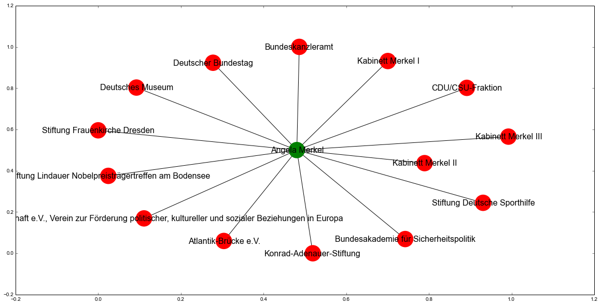
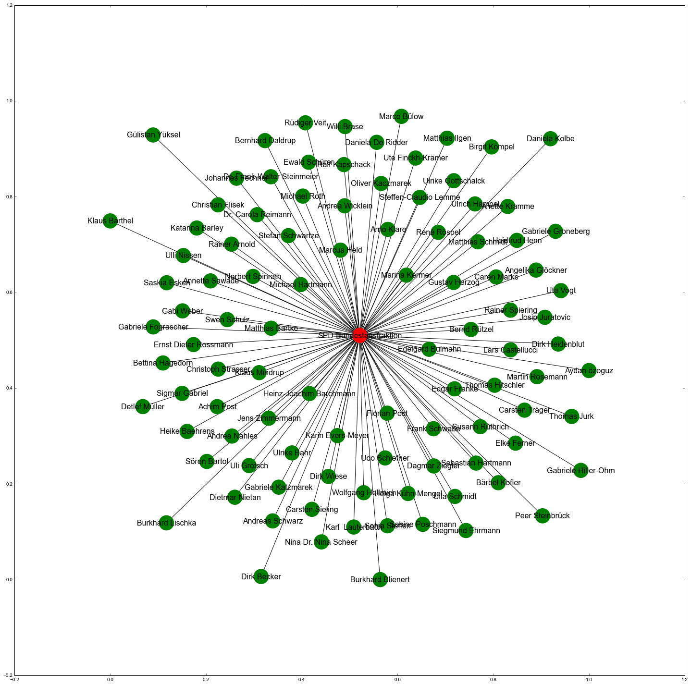
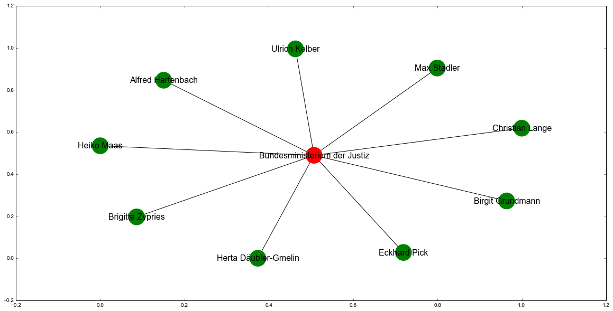

% Projekt-Bericht und Dokumentation im Kurs Wissensrepräsentation SoSe15
% Lukas Hodel; Richard Remus
% 21. Juli 2015

# Aufgabenstellung
Die gegebene Aufgabenstellung lautete:

Führen Sie ein Semantic Web / Linked Data Projekt durch. Dies sollte mehrere der folgenden Aspekte umfassen.

 - Verknüpfen von verschiedenen Datenquellen
 - Konvertierung von Daten ins RDF-Format (mit entsprechender T-Box)
 - Entwicklung von Ontologien 
 - Linked Data Anwendung 
 - Informationsextraktion/Web Scaping und Konvertierung in RDF
 - Entity Resolution
 - ..

Wir haben im Kurs bereits Erfahrungen mit dem [Lobbyradar des ZDF](https://github.com/lobbyradar/lobbyradar "ZDF Lobbyradar") und [DBpedia]("http://wiki.dbpedia.org") gemacht.

<!-- Hier sollte wohl noch ein Erklärung hin, was das Lobbyradar überhaupt ist.-->

Zuerst werden wir die im Lobbyradar enthaltenen Informationen in einen RDF-Graphen überführen. 
Danach werden wir eine Anbindung zu DBpedia entwickeln, in der Sparql-Queries zu den Entitäten des Graphen erstellt formuliert und abgeschickt werden können. Auch soll die Anwendung eine Suchworterweiterung bieten. 
Die Ergebnisse der Queries sollen dann wiederum in den bestehenden Graphen eingepflegt werden, anschliessend wird ein Teilgraph angezeigt, ind dessen Zentrum die gesuchte Entität steht und der die Relationen zu anderen Entiäten aufzeigt. 


# Analyse Lobbyradar
Lobbyradar enthält Knoten welche in JSON persistiert sind. Damit werden alle Entities und Relations agbebildet. Die Knoten enthalten schon für sich eine große Zahl an Properties:

```json
{'_id': '54bd3c768b934da06340f4c6',
 'aliases': [],
 'created': 'datetime.datetime(2015, 1, 19, 17, 18, 46, 529000)',
 'data': [{'auto': 'True',
   'created': 'datetime.datetime(2015, 1, 19, 17, 19, 9, 420000)',
   'desc': 'Quelle',
   'format': 'link',
   'id': '3dc1416e38deac59076cd3f0d4e1235de79cb530207d06c28053134cc8aa7732',
   'key': 'source',
   'updated': 'datetime.datetime(2015, 1, 19, 17, 19, 9, 420000)',
   'value': {'remark': 'created by lobbyliste importer',
    'url': 'http://bundestag.de/blob/189476/8989cc5f5f65426215d7e0233704b20a/
    lobbylisteaktuell-data.pdf'}},
  {'auto': 'True',
   'created': 'datetime.datetime(2015, 1, 19, 17, 19, 9, 420000)',
   'desc': 'Titel',
   'format': 'string',
   'id': '65873d29bd0ab6af91ef341689d28f4f0658cc851494a0ef34cfd07dd0cf5d42',
   'key': 'titles',
   'updated': 'datetime.datetime(2015, 1, 19, 17, 19, 9, 420000)',
   'value': 'Gesch\xe4ftsf\xfchrer'},
  {'auto': 'True',
   'created': 'datetime.datetime(2015, 1, 19, 17, 18, 46, 529000)',
   'desc': 'Titel',
   'format': 'string',
   'id': '1c98f43f0787b6dfcad25c38849ef3895bd26624a79c8fa9e6203c360d120fad',
   'key': 'titles',
   'updated': 'datetime.datetime(2015, 1, 19, 17, 18, 46, 529000)',
   'value': '2. Vorsitzender'}],
 'importer': 'lobbyliste',
 'name': 'Markus Hoymann',
 'search': ['markus hoymann'],
 'slug': 'markus hoymann',
 'tags': ['lobbyist', 'lobbyismus', 'executive'],
 'type': 'person',
 'updated': 'datetime.datetime(2015, 1, 19, 17, 19, 9, 426000)'}
```

Deshalb haben wir entschieden, von all diesen, nur die wichtigsten Eigenschaften abzubilden. 
Für Personen und Organisationen:

- id
- name
- created
- updated
- type *(Person, Organisation)*
- alias *(nur bei Organisationen)*
- tags *(als Interessengebiete)*

Für die Relationen zwischen diesen Entitäten benötigen wir auch eine Klassifikation. Die verschiedenen Bezeichnungen für die Ämter und Anstellungsverhältnisse der Personen, also ihre Positionen in der Lobbyradar-Datenbank, sind jedoch stark arbiträr, gehorchen keiner Syntax und liegen nur als Literal vorhanden sind. Es ist leider jedoch nicht ohne weiteres möglich einer Relation in RDF eine beliebige Bezeichnung zu geben. Dazu würden Hilfsknoten benötigen, welche den Graphen stark verkomplizieren würden. Da in der Datenbank auch viele Positionen mit semantisch gleichem Inhalt unterschiedliche Bezeichnungen haben, entweder weil keine einheitliche Benennung vorgegeben ist (*z.B. Bundesminister der Finanzen, Finanzminister, Minister der Finanzen*) oder weil die Importeure Tippfehler gemacht haben (*executive, ececutive*). Daher haben wir uns entschieden, die wichtigsten Relationen semantisch zu gruppieren und für diese zusammenfassende Properties zu erstellen.
Diese Zuordnung mussten wir händisch erledigen, aus Zeitgründen konnten wir also die restlichen Daten nicht Berücksichtigen.

# Aufbau einer Ontologie

## Konvertierung der Daten in RDF

## T-Box
Zunächst mussten wir für einige Entitäten neue Klassen anlegen, da es zum Beispiel für Dinge wie *BTCertUID* oder *Bundesland* noch keine RDFS-Klassen gibt. 

## A-Box

# Anbindung zu DBpedia

# Nachbetrachtung

- rdflib sollte beim hinzufügen von Knoten prüfen, ob die gegebenen Tripel sinnhaft sind und auf Knoten verweisen, die bereits da sind. g.add() ist da nicht *verbose* genug und sollte ruhig mal meckern und nicht still alles hinnehmen.

# Ausblick

- Daten genauer anschauen, z.B. Unterscheidung von Parteien zu anderen Organisationen
- Machine Learning zur Identifikation von Lobbyisten.


# Benutzung von Lobbyradar

Zu erst muss mal die Datei "Graph" und deren Funktionen importiert werden. Wichtig zu wissen ist das die libraries _pymongo_, _bson_, _rdflib_, _networkx_ und _matplotlib_ vorhanden sind.

```python
    import Graph
    from Graph import search_persons, person_connections,  \
                      search_organizations, \
                      organization_connections, plot_tripples, \
                      search_governmental, search_sparql
    %matplotlib inline # um schöne plotts zu erhalten
```

## Nach Personen suchen

Mit der Methode __search_persons__ kann mit Freitext nach Personen gesucht werden.

```python
    search_persons(name="angela m", limit=10)

    [u'Angela Merkel', u'Angela Marquardt']
```

## Verbindungen einer Person ausgeben

Hat man den korrekten Namen der Person, kann mit Hilfe der Methode __person_connections__ nach "connections" also Organisationen gesucht werden. Es wird eine Liste von Triples mit ('personenname', 'property', 'Organisationslabel') zurück gegeben.


```python
    angela_connections = person_connections("Angela Merkel")
    angela_connections[:2]
    
    [(u'Angela Merkel',
      u'http://example.org/isOtherwiseRelatedToGovernment',
      u'Bundeskanzleramt'),
     (u'Angela Merkel',
      u'http://example.org/isOtherMemberOf',
      u'Atlantik-Br\xfccke e.V.')]
```

## Resultat plotten

Die Methode __plot_tripples__ visualisiert nun die tripples in einem Graphen. Dabei werden die "Objekte" Grün und die "Subjekte" rot dargestellt. In unserem Fall sind die Personen grün und die Organisationen rot dargestellt.

```python
    plot_tripples(angela_connections)
```



## Nach Organisationen suchen

Mit der Methode __search_organizations__ kann mit Freitext nach Organisationen gesucht werden.

```python
    search_organizations("SPD")
    [u'SPD', u'SPD-NRW', u'SPD-Bundestagsfraktion', u'SPD Vorpommern']
```

## Verbindungen einer Organisationen ausgeben

Nun kann mit der Methode __organization_connections__ nach Personen-Verbindungen dieser Organisation gesucht werden.
Zurück kommt wieder ein Tripple. Analog zur Methode __person_connections__

```python
    org_conn_tripple = organization_connections("SPD-Bundestagsfraktion")
    org_conn_tripple[:4]

    [(u'Bernhard Daldrup',
      u'http://example.org/isOtherMemberOf',
      u'SPD-Bundestagsfraktion'),
     (u'Gabriele Hiller-Ohm',
      u'http://example.org/isOtherMemberOf',
      u'SPD-Bundestagsfraktion'),
     (u'Daniela De Ridder',
      u'http://example.org/isOtherMemberOf',
      u'SPD-Bundestagsfraktion'),
     (u'Nina Dr. Nina Scheer',
      u'http://example.org/isOtherMemberOf',
      u'SPD-Bundestagsfraktion')]
```

## Verbindungen einer Organisationen plotten

Diese können dann wieder mit der Methode __plot_tripples__ geplottet werden. Wenn der Graphen zu gross wird, kann die Größe des Plots selbst über figsize angegeben werden.

```python
    plot_tripples(org_conn_tripple, figsize=(25,25))
```



## Nach Bundes-Organisationen suchen

Mit der Methode __search_govenrmental__ kann ausschliesslich nach Bundesorganisationen gesucht werden.

```python
    gov_organizations = search_governmental()
    gov_organizations[:10]
```

```python
    [u'Nieders\xe4chsisches Kultusministerium',
     u'Bayrisches Staatsministerium f\xfcr Ern\xe4hrung, Landwirtschaft und Forsten',
     u'Bayrisches Staatsministerium f\xfcr Arbeit und Soziales, Familie und Integration',
     u'Ministerium f\xfcr Inneres und Kommunales Nordrhein-Westfalen',
     u'Hessisches Ministerium der Finanzen',
     u'Staatsministerium Baden-W\xfcrttemberg',
     u'Ministerium f\xfcr Landwirtschaft, Umwelt und Verbraucherschutz Mecklenburg-Vorpommern',
     u'Staatskanzlei Sachsen-Anhalt',
     u'Nieders\xe4chsisches Ministerium f\xfcr Ern\xe4hrung, Landwirtschaft und Verbraucherschutz',
     u'Ministerium f\xfcr Schule und Weiterbildung  Nordrhein-Westfalen']
```

```python
    plot_tripples(organization_connections("Bundesministerium der Justiz"))
```



## Eigene Sparql abfrage erstellen

Mit der Methode __search_sparql__ kann eine eigene Sparql Abfrage abgeschickt werden. Zurück erhält man ein rdflib Abfrage-Resultat. Dieses kann dann selbst nach belieben verwendet werden. 

Als Beispiel kann die Ontologie analysiert werden:

```python
    res = search_sparql(""" 
        SELECT DISTINCT ?property ?subproperty
        WHERE {
            ?subproperty rdfs:isSubPropertyOf ?property .
        }
        LIMIT 100
    """)
    
    for row in res:
        print("%s -> %s" % row)
```
    http://example.org/isMemberOf -> http://example.org/isOtherMemberOf
    http://example.org/isMemberOf -> http://example.org/isOrdinaryMemberOf
    http://example.org/isExecutiveOf -> http://example.org/isChairmanOfManagementOf
    http://example.org/isExecutiveOf -> http://example.org/isAdministrationBoardMemberOf
    http://example.org/isExecutiveOf -> http://example.org/isManagementMemberOf
    http://example.org/isExecutiveOf -> http://example.org/isDirectorOf
    http://example.org/isMemberOf -> http://example.org/isRelatedToGovernment
    http://example.org/isExecutiveOf -> http://example.org/isChairmanOfDirectorsBoardOf
    ...


